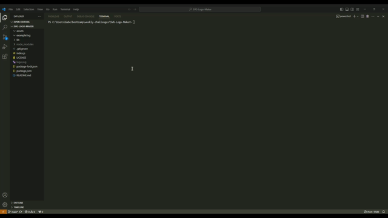

# SVG-Logo-Maker 
  

  ## Description

  This project is intended to help freelance developers create a simple and quick SVG logo.  You can quickly and efficiently answer four required prompts and an SVG file will be generated in the main directory of this repository.

  ## Table of Contents

  *[Installation](#installation)

  *[Usage](#usage)

  *[License](#license)

  *[Contributions](#contributions)

  *[Testing](#testing)

  *[Credits](#credits)

  *[Questions](#questions)

  ## Installation
  
  To "install" this application you will need to clone this repository using your terminal (git clone).  You will then need Node.js installed onto your computer.  You can find it here (https://nodejs.org/en/download/current).  You will also need inquirer  Version  8.2.4.  You can  run  npm i inquirer@8.2.4 in your main directory to install.  Lastly,  You will need to have Jest Version 28.1.3 to run the tests.  If you successfully cloned the repo you can just run npm install and all the necessary packages will install.


  ## Usage

  The main intent of this application is to create a SVG logo for a developers use in their project.  To start this make sure you have the necessary dependancies from the install section.  Once you complete that section you can then begin to run the application as it is fairly simple.  Run *node index.js* in your terminal and then you will be prompted with a series of questions.  Fill them out to your liking and then press enter.  You should then have a SVG file generated within your main directory.  If you open with live server your image will be available to you in your browser. Refer to this video for further directions.

  Initialization Video and Running the App:
  

  Testing the App:
  

  Initialization Video Link: https://drive.google.com/file/d/1YxSpT6GRdIA34poJlBf_6djUrkNG79Sw/view 

  Testing Video Link: https://drive.google.com/file/d/1saXJTXgUXlJPbwGKtq0xbX-qDRsimnkl/view
  
  ## License

  This project is licensed under the MIT license.

  ## Contributions

  Contributors please refer to the installation section.

  ## Testing

  To correctly test this application run:

  ```
  npm test
  ```

  ## Credits

  A majority of this project was built with the help of XpertLearning Assistant. 

  ## Questions

  If you have any questions regarding this project, you can contact me directly at gstroup11@gmail.com.

  You can see more of my work at [gstroup11](https://github.com/gstroup11/).